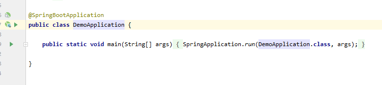
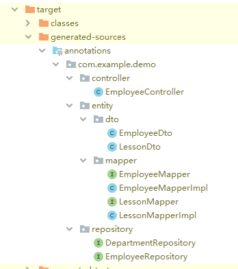

### EasyEntity2 Demo

#### EasyEntity2项目

[EasyEntity2](https://github.com/AtalisasOwen/OSSRH-56688) 欢迎提Issues和Star

#### 安装
```
git clone https://github.com/AtalisasOwen/EasyEntityExample.git
直接运行Spring Boot主程序 
```

#### 生成代码指南
运行: 直接点击“三角小箭头”



查看生成的代码：在target/generated-sources/annotations目录下



修改生成代码的路径：在pom.xml下添加
```asp
    <build>
        <plugins>
            <plugin>
                <groupId>org.springframework.boot</groupId>
                <artifactId>spring-boot-maven-plugin</artifactId>
            </plugin>
            <plugin>
                <groupId>org.apache.maven.plugins</groupId>
                <artifactId>maven-compiler-plugin</artifactId>
                <configuration>
                    <source>8</source>
                    <target>8</target>
                    <compilerArguments>
                        <extdirs>${project.basedir}/lib</extdirs>
                    </compilerArguments>
                    <!-- 若要直接生成源代码到src，加上之后的注释 -->
<!--                    <generatedSourcesDirectory>-->
<!--                        src/main/java-->
<!--                    </generatedSourcesDirectory>-->
                </configuration>
            </plugin>
        </plugins>
    </build>
```
---
#### 注解说明
`@Dto`：生成该Entity的Dto类和Mapper类
- `@DtoField`: 将引用类型的字段，转为其内部的引用类型，如`Department{dprt.id} => Long{id}`
- `@DtoIgnore`: 忽略该字段
- `@DtoCollectionField`: 类似@DtoField, 不过是List或者Set，如`List<Department>{dprt.id} => List<Long>{id}`
- `@DtoEntityField`: 表示该字段也是一个Dto， 如`Department => DepartmentDto, List<Department> => List<DepartmentDto>`
- `@DtoCustomField`: 表示该字段，需要自定义Mapper，常用于微服务的外部调用，如`Long id => Department dprt`


`@AutoRepository`：生成该Entity的JpaRepository，继承JpaRepository， JpaSpecificationExecutor
- 后续会添加不同的生成策略，如Mybatis等

`@AutoController`：该注解针对Service，根据Service的方法名，返回值等，自动生成Controller层

Service：
```java
public class EmployeeService {
    // ...
    
    public Employee getEmployee(Long id){
            return employees.stream().filter(e -> e.getId().equals(id)).collect(Collectors.toList()).get(0);
    }
    
    public List<Employee> getEmployees(){
            return employees;
    }
    
    public Department addDepartment(Department department){
            return departmentRepository.save(department);
    }
    
    public void deleteDepartment(Long id){
    }

}
```

自动生成的Controller
```java
@RestController
@RequestMapping("/api")
public class EmployeeController {
    @Autowired
    com.example.demo.service.EmployeeService service;

    com.example.demo.entity.mapper.EmployeeMapper mapper = com.example.demo.entity.mapper.EmployeeMapper.INSTANCE;

    @GetMapping("/employee/{id}")
    public com.example.demo.entity.dto.EmployeeDto getEmployee(@PathVariable("id") java.lang.Long id)  {
        return mapper.toDto(service.getEmployee(id));
    }

    @GetMapping("/employees")
    public java.util.List<com.example.demo.entity.dto.EmployeeDto> getEmployees()  {
        return service.getEmployees().stream().map(mapper::toDto).collect(Collectors.toList());
    }

    @PostMapping("/department")
    public com.example.demo.entity.Department addDepartment(@Valid @RequestBody com.example.demo.entity.Department department)  {
        return service.addDepartment(department);
    }

    @DeleteMapping("/department/{id}")
    public void deleteDepartment(@PathVariable("id") java.lang.Long id)  {
        service.deleteDepartment(id);
    }
}
```